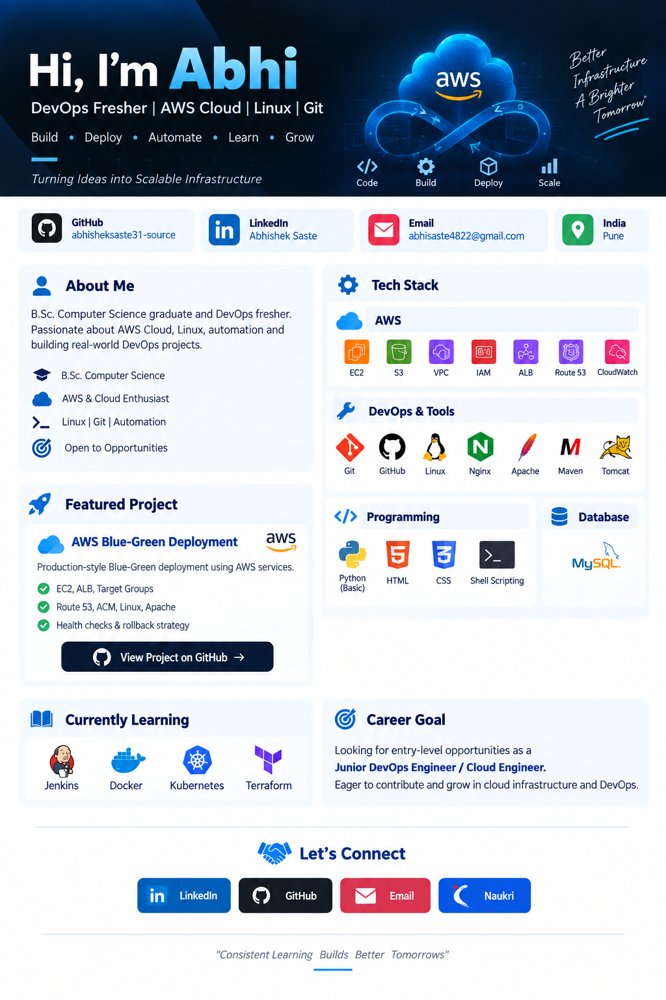

<p align="center">
  
</p>

<h1 align="center">Hi, I'm Abhi 👋</h1>

<h3 align="center">
☁️ Multi-Cloud & DevOps Fresher | AWS | Azure | GCP | Linux | CI/CD
</h3>

<p align="center">
Building practical cloud infrastructure, automation, CI/CD pipelines and deployment solutions.
</p>

<p align="center">
  <a href="https://github.com/abhisheksaste31-source">
    
  </a>
  <a href="https://www.linkedin.com/in/abhisheksaste">
    
  </a>
  <a href="mailto:abhisaste4822@gmail.com">
    
  </a>
</p>

<p align="center">
  
</p>

---

# 👨‍💻 About Me

I'm a **B.Sc. Computer Science graduate and Multi-Cloud & DevOps Fresher** passionate about cloud infrastructure, automation, CI/CD, Linux administration and application deployment.

I enjoy learning by building **real-world cloud and DevOps projects** rather than focusing only on theory.

### 🚀 My Focus Areas

- ☁️ Multi-Cloud Infrastructure
- 🔄 CI/CD Automation
- ⚙️ DevOps Engineering
- 🐧 Linux Administration
- 🌐 Cloud Networking
- 🏗️ Infrastructure as Code
- 🐳 Containers & Orchestration
- 🔐 Cloud Security
- 📊 Monitoring & Logging
- 🚀 Application Deployment

---

# ☁️ Multi-Cloud Skills

### 🟠 Amazon Web Services

<p align="center">


</p>

`EC2` `VPC` `IAM` `S3` `EBS` `EFS` `ALB` `Auto Scaling`

`Route 53` `ACM` `CloudFront` `CloudWatch` `AMI` `EBS Snapshots`

`Lambda` `API Gateway` `RDS` `ElastiCache` `Redshift`

`Elastic Beanstalk` `DMS` `SQS` `EventBridge` `Transfer Family`

---

### 🔵 Microsoft Azure

<p align="center">


</p>

`Virtual Machines` `Virtual Network` `Azure Storage`

`Load Balancer` `IAM` `Azure Monitor` `App Services`

---

### 🔴 Google Cloud Platform

<p align="center">


</p>

`Compute Engine` `VPC` `Cloud Storage` `IAM`

`Cloud Load Balancing` `Cloud Monitoring` `Cloud Run`

---

# ⚙️ DevOps & Automation

### 🔄 CI/CD

<p align="center">


</p>

`Jenkins` `GitHub Actions`

### 🐳 Containers & Orchestration

<p align="center">


</p>

`Docker` `Kubernetes`

### 🏗️ Infrastructure as Code

<p align="center">


</p>

`Terraform` `AWS CloudFormation`

### 🐧 Linux & Scripting

<p align="center">


</p>

`Linux` `Bash` `Shell Scripting`

### 🌐 Web & Application Servers

`Nginx` `Apache` `Tomcat` `Maven`

---

# 💻 Programming & Development

<p align="center">


</p>

### Languages

`Java` `C` `C++` `Python (Basic)` `Shell Scripting`

### Web Technologies

`HTML5` `CSS3` `JavaScript` `JSP`

### Backend / Build

`Maven` `Apache Tomcat`

---

# 🗄️ Database

<p align="center">


</p>

`MySQL` `PostgreSQL` `PL/pgSQL`

---

# 🚀 Featured DevOps Projects

## 🔵 AWS Blue-Green Deployment

Production-style deployment architecture using AWS.

**Technologies:**

`EC2` `Application Load Balancer` `Target Groups` `Route 53` `ACM` `Linux` `Apache`

### Key Features

- 🔵 Blue & Green environments
- ⚖️ Application Load Balancer
- 🎯 Target Groups
- ❤️ Health Checks
- 🌐 Route 53 integration
- 🔐 HTTPS with ACM
- 🔄 Safer application releases
- ↩️ Rollback-friendly deployment

🔗 **[View Project](https://github.com/abhisheksaste31-source/aws-blue-green-deployment)**

---

## 🔥 Highly Available 3-Tier AWS Architecture

Designed and implemented a highly available AWS 3-tier architecture.

**Technologies:**

`AWS VPC` `EC2` `ALB` `Auto Scaling` `NAT Gateway` `Route 53` `CloudFront` `ACM`

### Architecture

```text
                    Internet
                       │
                       ▼
                  CloudFront
                       │
                       ▼
                 Route 53 / ACM
                       │
                       ▼
                Public Load Balancer
                       │
              ┌────────┴────────┐
              ▼                 ▼
          Web Tier          Web Tier
          EC2/ASG           EC2/ASG
              │                 │
              └────────┬────────┘
                       ▼
                Internal ALB
                       │
                       ▼
                 Application Tier
                       │
                       ▼
                  Database Tier
```

🔗 **[View Project](https://github.com/abhisheksaste31-source/aws-highly-available-3-tier-architecture)**

---

## 🚀 Automated CI/CD Pipeline

Implemented a Java Maven CI/CD pipeline using GitHub Actions.

**Technologies:**

`Java` `Maven` `GitHub Actions` `SonarQube` `Apache Tomcat` `Linux`

### Pipeline

```text
Developer
     │
     ▼
GitHub
     │
     ▼
GitHub Actions
     │
     ├── Checkout
     ├── JDK Setup
     ├── Maven Build
     ├── SonarQube Analysis
     ├── WAR Artifact
     │
     ▼
Apache Tomcat
     │
     ▼
Application
```

### Key Features

- 🔄 Automated CI/CD
- ☕ Java Maven build
- 🔍 SonarQube analysis
- 📦 WAR artifact management
- 🚀 Automated Tomcat deployment
- 🔐 GitHub Secrets
- ✅ Deployment verification

🔗 **[View Project](https://github.com/abhisheksaste31-source/github-actions-project-me)**

---

# 🛠️ DevOps Toolset

<p align="center">


</p>

<p align="center">


</p>

---

# 🔐 DevSecOps & Security

I'm building knowledge in:

- 🔐 IAM & Access Control
- 🔑 Secrets Management
- 🛡️ Secure Cloud Configuration
- 🔍 SonarQube Code Quality
- 🔒 HTTPS / SSL Certificates
- 🌐 Network Security
- 🔥 Security Groups & NACLs
- 📦 Secure CI/CD Practices

---

# 📊 Monitoring & Observability

### AWS

`CloudWatch` `CloudWatch Logs` `CloudWatch Metrics`

### Azure

`Azure Monitor`

### GCP

`Cloud Monitoring`

### DevOps

`Application Logs` `Linux Logs` `Health Checks`

---

# 🎓 Education

🎓 **B.Sc. Computer Science**

Focused on:

`Computer Science` `Programming` `Database Systems` `Networking` `Operating Systems`

---

# 💼 Career Interests

I'm interested in entry-level opportunities in:

```text
☁️ Cloud Engineer
🚀 DevOps Engineer
🔥 AWS Cloud Engineer
🌐 Multi-Cloud Engineer
⚙️ Junior DevOps Engineer
🛠️ Cloud Operations Engineer
```

---

# 📚 Currently Learning

```text
AWS
 │
 ├── Cloud Architecture
 ├── Networking
 ├── Security
 └── High Availability

DevOps
 │
 ├── Jenkins
 ├── GitHub Actions
 ├── Docker
 ├── Kubernetes
 └── Terraform

Cloud
 │
 ├── Azure
 └── GCP

Advanced
 │
 ├── DevSecOps
 ├── Monitoring
 └── Automation
```

---

# 🌱 My DevOps Journey

```text
Programming
     ↓
Linux
     ↓
Networking
     ↓
Git & GitHub
     ↓
AWS
     ↓
Azure & GCP
     ↓
CI/CD
     ↓
Jenkins & GitHub Actions
     ↓
Docker
     ↓
Kubernetes
     ↓
Terraform
     ↓
DevSecOps
     ↓
Multi-Cloud DevOps
```

### 🚀 Learn → Build → Automate → Deploy → Improve

---

# 📈 GitHub Statistics

<p align="center">


</p>

<p align="center">


</p>

---

# 📌 What I'm Building

I believe the best way to learn DevOps is through **hands-on implementation**.

Currently focusing on building projects around:

```text
☁️ Cloud Infrastructure
⚙️ Automation
🔄 CI/CD
🐳 Containers
🏗️ Infrastructure as Code
🔐 DevSecOps
📊 Monitoring
🌐 Multi-Cloud
```

---

# 📫 Let's Connect

<p align="center">

<a href="https://github.com/abhisheksaste31-source">

</a>

<a href="https://www.linkedin.com/in/abhisheksaste">

</a>

<a href="mailto:abhisaste4822@gmail.com">

</a>

</p>

---

<p align="center">

### ☁️ Multi-Cloud • DevOps • Automation • CI/CD

### 🚀 Build. Automate. Deploy. Scale.

**Consistent Learning Builds Better Tomorrows.**

</p>
